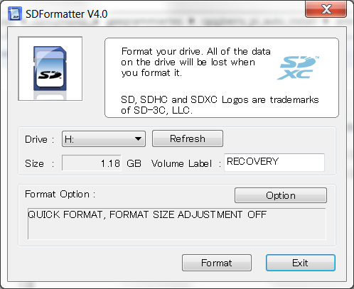
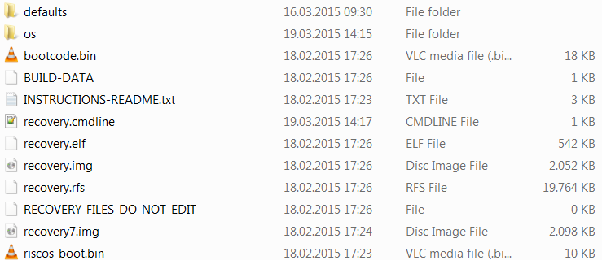
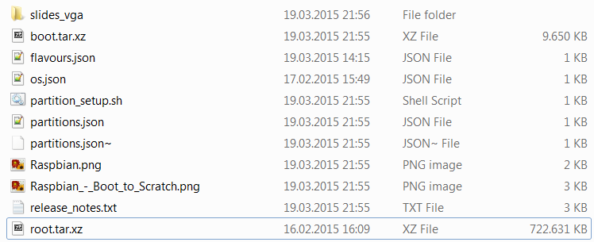
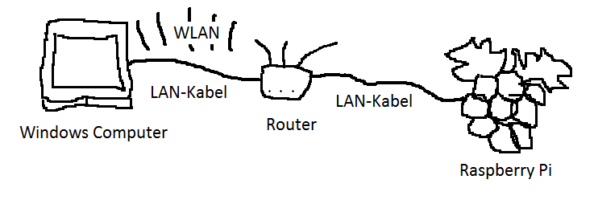
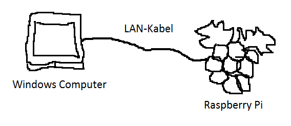
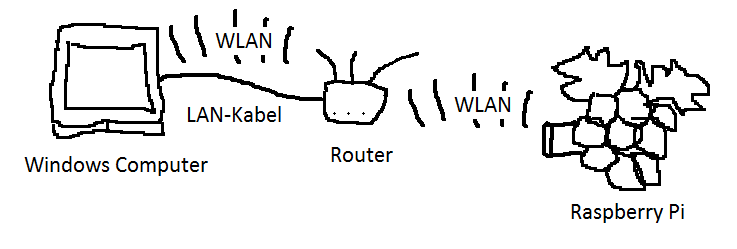
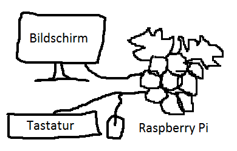
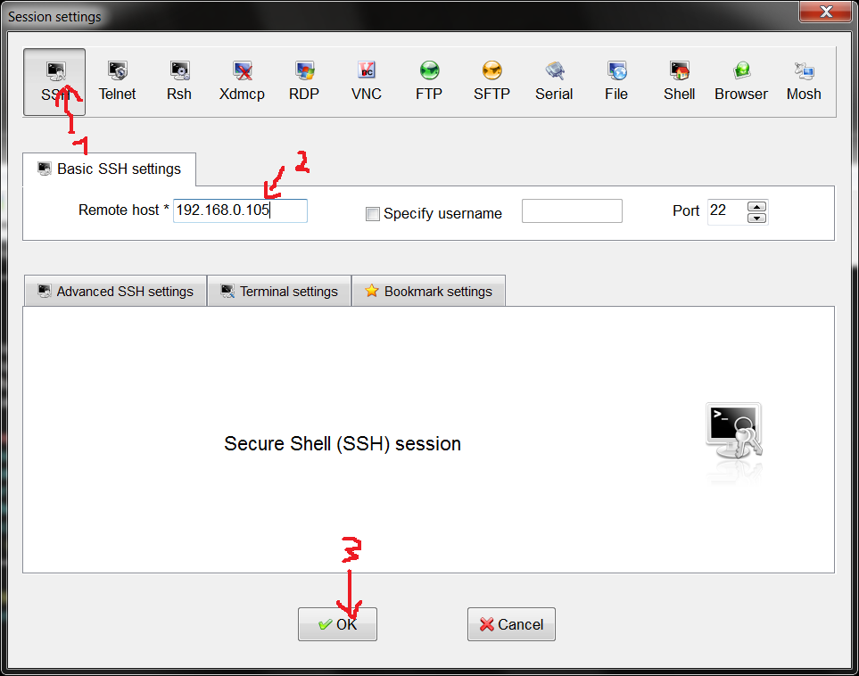
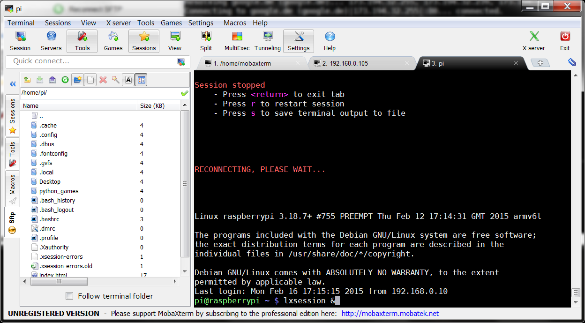

Raspberry Pi Installation unter Windows
=======================================

Diese Installation kann ohne Maus und Tastatur durchgeführt werden. Wenn die Anleitung schon einmal durchlaufen wurde, kann zu 8. gesprungen werden.

Vorbereitung
------------

Diese Gegenstände werden benötigt:

 - 1 Computer mit Windows und SD-Kartenleser
 - 1 LAN-Kabel
 - 1 Raspberry Pi
 - 1 SD-Karte
 - 1 Raspberry Pi Stromversorgung

Folgende Software muss herunter geladen werden:

 - [NOOBS Offline and network install](http://www.raspberrypi.org/downloads/) nicht NOOBS LITE
 - [master.zip](https://github.com/niccokunzmann/raspberry_pi_installation/archive/master.zip) - dieses Repository
 - [Python3](https://www.python.org/ftp/python/3.4.3/python-3.4.3.msi)
 - [MobaXTerm](http://mobaxterm.mobatek.net/download-home-edition.html)
 - [SD Card Formatter](https://www.sdcard.org/downloads/formatter_4/)
 - [python_dhcp_server](https://github.com/niccokunzmann/python_dhcp_server/archive/master.zip)

1. Download
-----------

Wir befinden uns auf dem Windowscomputer. 

**Die Datei [`raspberry_pi_installation-master.zip`](https://github.com/niccokunzmann/raspberry_pi_installation/archive/master.zip) muss heruntergeladen werden.** 

**Die Datei [`NOOBS_v1_4_0.zip`](http://www.raspberrypi.org/downloads/) muss heruntergeladen werden.** 

Es gibt auch `NOOBS LITE` aber das ist nicht gemeint.

Die Dateien landen wahrscheinlich im Downloads-Ordner oder dort, wo man sie hinspeichert.
Während der Download läuft, können schon einige Programme installiert werden.

_Nebenbei: Die Dateien in `raspberry_pi_installation-master.zip` sind die selben wie in `NOOBS_v1_4_0.zip`. [Diese Anweisungen](http://raspberrypi.stackexchange.com/questions/15192/installing-raspbian-from-noobs-without-display) erzeugen aus `NOOBS_v1_4_0.zip` die selben Dateien wie in `raspberry_pi_installation-master.zip`._

2. Installation
---------------

Python3 muss installiert werden, um später die Netzwerkadresse des Raspberry Pis herauszubekommen.

**[Python3](https://www.python.org/ftp/python/3.4.3/python-3.4.3.msi) herunterladen und installieren.**

MobaXTerm erlaubt es uns, sowohl die Kommandozeile als auch die grafische Oberfläche des Raspberry Pi zu benutzen.

**[MobaXTerm](http://mobaxterm.mobatek.net/download-home-edition.html) herunterladen und installieren oder entpacken.**

Mit dem SD Card Formatter formatieren wir die SD-Karte, sodass wir die benötigten Dateien für das Betriebssystem des Raspberry Pi darauf kopieren können.

**[SD Card Formatter](https://www.sdcard.org/downloads/formatter_4/) herunterladen und installieren.**

3. Die SD-Karte Formatieren
---------------------------

1. Die SD-Karte kontrollieren, dass der Schalter nicht auf LOCK steht.
2. Die SD-Karte in den Rechner einführen.
3. SD Card Formatter starten.
4. Bei `Drive:` die richitge SD-Karte auswählen, da nach Schritt 6 alle Dateien gelöscht werden.
5. Auf `Format` klicken.
6. Die Dialoge verstehen und bestätigen.

Danach ist die SD-Karte leer.

3. Das Betriebssystem einrichten
--------------------------------

In der heruntergeladenen Datei  [`raspberry_pi_installation-master.zip`](https://github.com/niccokunzmann/raspberry_pi_installation/archive/master.zip) befinden sich die Installationsdateien für das Betriebssystem, die schon zur automatischen Installation angepasst wurden.

**`raspberry_pi_installation-master.zip` öffnen und alle Dateien, die im Ordner [`NOOBS_v1_4_0`](../NOOBS_v1_4_0) sind, auf die SD-Karte kopieren.**

Danach befinden sich solche Dateien unmittelbar auf der SD-Karte:

Sie sind nicht in einem Ordner auf der SD-Karte, da sonst der Raspberry Pi sie nicht bootet.

Jetzt brauchen wir noch die Datei, die das Betriebssystem enthält. Sie ist in der Datei `NOOBS_v1_4_0.zip`.

**`NOOBS_v1_4_0.zip` öffnen und die Datei `os\Raspbian\root.tar.xz` auf die SD-Karte in den Ordner `os\Raspbian` kopieren.**

So sieht es dann im Ordner `os\Raspbian` auf der SD-Karte aus.

_Nebenbei: Benutername und Passwort kann man in der Datei [os\Raspbian\os.json](../NOOBS_v1_4_0/os/Raspbian/os.json) ändern. Dazu muss man [Notepad++](http://notepad-plus-plus.org/download/) installieren oder einen anderen Editor, der sich auf Linux-Dateiendungen versteht und nicht alles in einer Zeile anzeigt.  
[Mit diesem Tutorial](http://raspberrypi.stackexchange.com/questions/15192/installing-raspbian-from-noobs-without-display) kann man direkt aus `NOOBS_v1_4_0.zip` die SD-Karten Dateien zum automatischen Boot anpassen_

Sollte man nur WLAN für den Raspberry Pi zur Verfügung haben, kein LAN, dann muss jetzt die WLAN-Konfiguration in Schritt 5.4 geschehen.

4. Das Betriebssystem installieren
----------------------------------

Jetzt sind alle notwendigen Dateien auf der SD-Karte und das Betriebssystem kann installiert werden. Das dauert eine halbe bis eine Stunde.

1. SD-Karte in Raspberry Pi einführen.
2. Raspberry Pi mit Strom versorgen.
3. Eventuell einen Bildschirm anschließen, um bei der Installation zuzusehen. 

Die Installation kann man sich auch [hier](http://www.raspberrypi.org/help/noobs-setup/) ansehen. Die Lichter des Raspberry Pi sollten dabei blinken oder leuchten. Wenn nur das rote PWR-Licht leuchtet, dann muss er neu gestartet werden, da er nichts macht.

5. Den Raspberry Pi mit dem Rechner Verbinden
---------------------------------------------

Es gibt mehrere Möglichkeiten, sich mit dem Raspberry Pi zu verbinden. Am besten in der Reihenfolge sehen, ob sie in diesem Fall passen. Internetzugriff für den Raspberry Pi ist nicht wichtig und wird nur benötigt, um neue Software zu installieren. 

1. Über ein bestehendes Netzwerk wie es zu Hause besteht mit Internetzugriff
2. Eine Direktverbindung für den Raspberry Pi ohne Internetzugriff
3. Eine Direktverbindung mit Netzwerkbrücke mit Internetzugriff
4. WLAN mit Internetzugriff
5. Maus und Tastatur mit Bildschirm ohne Internetzugriff

### 5.1 Verbindung über ein bestehendes Netzwerk

Der Raspberry Pi wird mit einem LAN-Kabel mit dem Router direkt oder indirekt verbunden. Der Laptop befindet sich im selben Netz und ist mit LAN-Kabel oder WLAN verbunden. Der Router ist z.B. eine Fritzbox, Alice- oder Telekombox.
Der Raspberry Pi erhält Internetzugriff.

### 5.2 Direktverbindung

Das LAN-Kabel wird in den Laptop und das andere Ende in den Raspberry Pi gesteckt. Dadurch hat der Raspberry Pi keinen Internetezugriff aber wir können auf ihn drauf.

### 5.3 Direktverbindung mit Netzwerkbrücke

Da Option 5.2 keinen Internetzugriff bietet aber man den Raspberry Pi nicht immer mit dem LAN-Kabel an ein Netzwerk anschließen kann, kann man über den Laptop eine Internetverbindung herstellen.

[Die Anleitung befindet sich hier.](network-bridge.md)

### 5.4 WLAN

Dazu braucht man einen USB-WLAN-Adapter. Dies ist eine Option, wenn Kein LAN-Kabel bereit steht. Sollte die Verbindung mit dem WLAN nicht gehen, muss neu installiert werden. Ein Versuch dauert also mindestens eine halbe Stunde.

Man kann in [`os\Raspbian\root.tar.xz`](../NOOBS_v1_4_0/os/Raspbian/root.tar.xz) die Daten editieren und das WLAN einrichten. Zum Öffnen der Datei `os\Raspbian\root.tar.xz` braucht man [7Zip](http://7-zip.org/download.html), zum Editieren [Notepad++](http://notepad-plus-plus.org/download/).  
Die Datei `/etc/network/interfaces` in dem Archiv `os\Raspbian\root.tar.xz` vorher:

    auto lo
    
    iface lo inet loopback
    iface eth0 inet dhcp
    
    allow-hotplug wlan0
    iface wlan0 inet manual
    wpa-roam /etc/wpa_supplicant/wpa_supplicant.conf
    iface default inet dhcp

Nachher:

    auto lo
    
    iface lo inet loopback
    iface eth0 inet dhcp
    
    allow-hotplug wlan0
    #iface wlan0 inet manual
    iface wlan0 inet dhcp
        wpa-ssid WLAN_NAME
        wpa-psk WLAN_PASSWORT
    wpa-roam /etc/wpa_supplicant/wpa_supplicant.conf
    iface default inet dhcp

`WLAN_NAME` muss mit dem WLAN-Namen ersetzt werden. `WLAN_PASSWORT` muss mit dem WLAN-Passwort ersetzt werden. Wenn das WLAN kein Passwort braucht, dann kann man die Zeile mit `wpa-psk` weglassen. Wenn man sich einmal verbunden hat, kann man auch Start>Internet>wpagui verwenden, um das WLAN einzurichten.

Der Raspberry Pi würde dann nach dem Neustart mit einem USB-WLAN-Stick sich zu dem WLAN verbinden. Das Problem dabei: Ist ein Fehler drin und der Raspberry Pi verbindet sich nicht, muss man von vorne installieren.

### 5.5 Tastatur, Maus und Bildschirm anschließen

Das ist die einfache Variante, wenn die Hardware vorhanden ist. Klärt aber immernoch nicht, wie der Raspberry an Internet kommt. Allerdingt erspart das Schritte 6, 7 und 8.

6. Den Raspberry Pi finden
--------------------------

Sobald das  Betriebssystem Raspberian auf dem Raspberry Pi erfolgreich installiert wurde, startet der Raspberry Pi neu und meldet sich im Netzwerk an.

**[pythondhcpserver](https://github.com/niccokunzmann/python_dhcp_server/archive/master.zip) herunterladen und entpacken.**

Diese Dateien sollten sich dann in einem Ordner befinden:

**Das Programm `dhcpgui` ausführen** 

Dazu muss zuerst [Python3](https://www.python.org/ftp/python/3.4.3/python-3.4.3.msi) installiert worden sein.  
Es öffnet sich ein solches Fenster:

Einträge wie

    B8:27:EB:0E:56:89	192.168.0.105	raspberrypi

bedeuten, dass es im Netzwerk jemanden gibt, der von sich behauptet, `raspberrypi` zu heißen und die IP-Adresse `192.168.0.105` zu besitzen.

Wenn der Raspberry Pi nicht auftaucht, kann ihn neuzustarten helfen. Wenn er dann immernoch nicht auftaucht, weiß ich auch nicht.

_Nebenbei: Manche Einträge sind alt und die Rechner gibt es nicht mehr. Um das Netzwerk neu aufzunehmen, muss man die Datei `ips.csv` löschen und das Programm `dhcpgui` neu starten. Dieses Programm weist auch IP-Adressen zu. Das geschieht verzögert, also wirkt es nur im Fall 5.2._

7. Zum Raspberry Pi verbinden.
------------------------------

[Die Anleitung gibt es auch in Englisch](http://www.raspberrypi.org/forums/viewtopic.php?f=26&t=21610)

1. MobaXTerm Personal Edition starten.
2. Neue Session anlegen.   

     

3. SSH auswählen, IP-Adresse einfüllen und OK klicken.

    

4. Die neu erstellte Session auswählen und starten.
5. Nutzername `pi` und Passwort `raspberry` eingeben.
6. Beim ersten Start wird eine Konfiguration verlangt. Dazu muss man `sudo raspi-config` eingeben und ENTER drücken. Man kann dort
     - Das Passwort setzen
     - Desktop booten einschalten, dass man beim Start nicht in der Kommandozeile landet
     - Die Sprache ändern
     - Die Kamera anschalten
     - Den Hostnamen ändern, damit man den Raspberry Pi im Netzwerk besser wiederfindet
7. Finish
8. Mit dem Befehl 

        sudo apt-get -y update; sudo apt-get -y dist-upgrade; sudo apt-get  -y autoremove;sudo apt-get -y autoclean

    das Betriebssystem aktualisieren. Das geht nur mit Internetzugriff.
9. Um die grafische Oberfläche zu fixen, muss dieser Befehl ausgeführt werden: 

        rm -r ~/.config/lxpanel/LXDE;(cp -rp ~/.config/lxpanel/LXDE-pi/ ~/.config/lxpanel/LXDE || cp -rp /etc/xdg/lxpanel/profile/LXDE ~/.config/lxpanel/LXDE)

    Wenn der Pi mit grafischer Oberfläche gestartet wird, dann wird die Oberfläche verwendet, die oben eine graue Taskleiste anzeigt. Sonst wird die Standartoberfläche verwendet, die unten eine schwarze Taskleiste anzeigt.

10. Mit dem Befehl `lxsession &` kann man jetzt die Oberfläche des Raspberry Pi starten. Manche Befehle, die verwendet werden können, sind in 9. beschrieben.

8. Den Pi benutzen
------------------

Der Prozess, um den Raspberry Pi zu verwenden sieht dann in Zukunft wie folgt aus:

1. Den Raspberry Pi mit dem Rechner verbinden, wie in 5. beschrieben.
2. Das Programm `dhcpgui` ausführen, wie in 6. beschrieben.
3. Den Raspberry Pi starten.
4. Die IP-Adresse herausfinden, wie in 6. beschrieben.
5. Mit MobaXTerm verbinden. Wenn die IP-Adresse gleich geblieben ist, kann die letzte Session verwendet werden, sonst muss eine neue erstellt werden, wie in 7. beschrieben.

9. Nützliche Befehle
--------------------

In der Session von MobaXTerm kann man Programme starten.

 - `lxsession` startet den Desktop
 - `startx` startet die grafische Oberfläche, wenn man sich mit Maus, Bildschirm und Tastatur davor befindet
 - `sudo raspi-config` startet die Konfiguration für den Raspberrry Pi
 - `idle3 &` started die Python Shell
 - `pcmanfm &` startet den Dateibrowser

Das `&` dahinter führt dazu, dass man mehrere Befehle eingeben kann.

### 9.1 Taskleiste verschwinden lassen

Die Taskleiste befindet sich jetzt oben und blockiert die Fenster. Man kann die Taskleiste automatisch verstecken. Dazu muss man etwas editieren:

    nano ~/.config/lxpanel/LXDE/panels/panel

Wo `autohide=0` steht muss `autohide=1` hin, damit die Taskleiste sich versteckt.  
Wo `edge=` steht, kann in die Zeile `edge=top` oder `edge=bottom`, um die Taskleiste oben oder unten anzuzeigen.  
`Strg+o` speichert, `Strg+x` schließt den Editor. Danach muss `lxsession` neu gestartet werden.

10. Quellen
-----------

 - [Installation von NOOBS](http://www.raspberrypi.org/help/noobs-setup/)
 - [Automatisieren der Installation von NOOBS](http://raspberrypi.stackexchange.com/questions/15192/installing-raspbian-from-noobs-without-display)
 - [Auf den Raspberry Pi zugreifen](http://www.raspberrypi.org/forums/viewtopic.php?f=26&t=21610)
 - [Linux WLAN](http://www.cyberciti.biz/faq/debian-linux-wpa-wpa2-wireless-wifi-networking/)
 - [`lxsession` hat keine Taskleiste](http://www.raspberrypi.org/forums/viewtopic.php?p=217773#p217773)