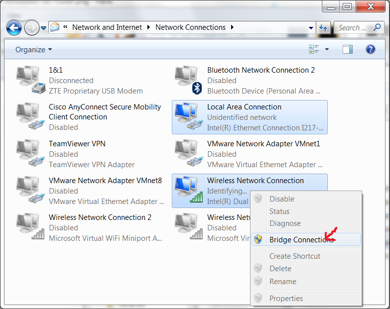
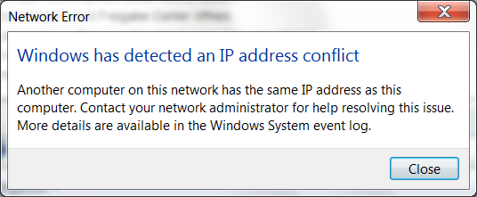
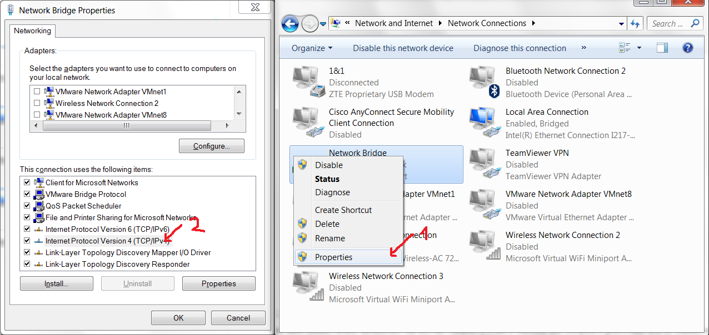
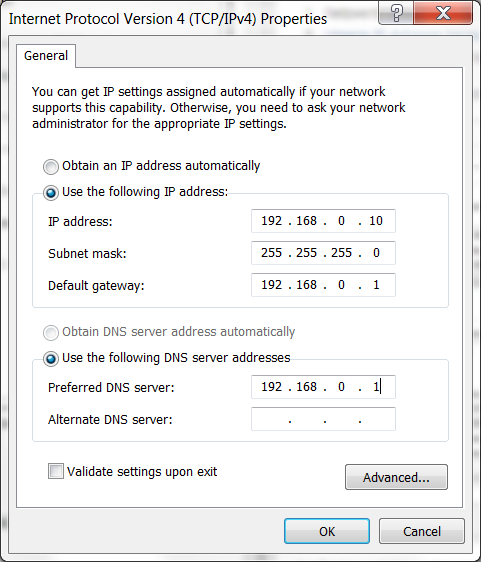

5.3 Direktverbindung mit Netzwerkbrücke
=======================================

Da Option 5.2 keinen Internetzugriff bietet aber man den Raspberry Pi nicht immer mit dem LAN-Kabel an ein Netzwerk anschließen kann, kann man über den Laptop eine Internetverbindung herstellen.

Dazu muss man

1. Auf das WLAN-Symbol unten rechts klicken.
2. Das Netzwerk und Freigabe Center öffnen.
3. Links auf dem Blauen auf Verbindungen Anzeigen klicken.
4. Die Verbindungen mit der Steuerungstaste beide markieren.
5. Wie unten im Bild die Netzwerkbrücke erstellen.

Sollte dann dieses Fenster auftauchen, hat sich der Raspberry Pi die IP-Adresse des Computers geschnappt:

Wenn das Fenster nicht auftaucht, dann geht es [weiter mit der Anleitung](./README.md). Eventuell taucht es aber später auf, wenn der Raspberry Pi neu gestartet ist.

Das Fenster ist aufgetaucht. Wir müssen manuell eine neue Adresse eingeben.

1. Netzwerbrücke löschen.
2. [Unsere IP-Adresse herausfinden (googlen)](http://www.tippscout.de/windows-xp-ip-adresse-des-computers-ermitteln-und-herausfinden_tipp_2676.html). 
3. Nochmal die Netzwerkbrücke erstellen.

Danach müssen wir die IP-Adresse von der Brücke Manuell einstellen, wie unten gezeigt:

Am Besten erhöhen oder erniedrigen wir die letzte Zahl der IP-Adresse etwas.

Aus `192.168.0.100` mache ich z.B. `192.168.0.10`. 
Die Gateway-IP findet man auch beim [IP-Adresse-Herausfinden (googlen)](http://www.tippscout.de/windows-xp-ip-adresse-des-computers-ermitteln-und-herausfinden_tipp_2676.html). Sie hat meistens die 1 hinten und fängt so an wie die eigene IP.

OK. OK. Und wenn das Internet noch geht, ist alles richtig.

Das Gute ist: wir wissen jetzt die IP-Adresse des Raspberry Pi und können den Schritt 6 überspringen. 

[Zurück zur Anleitung](./README.md)